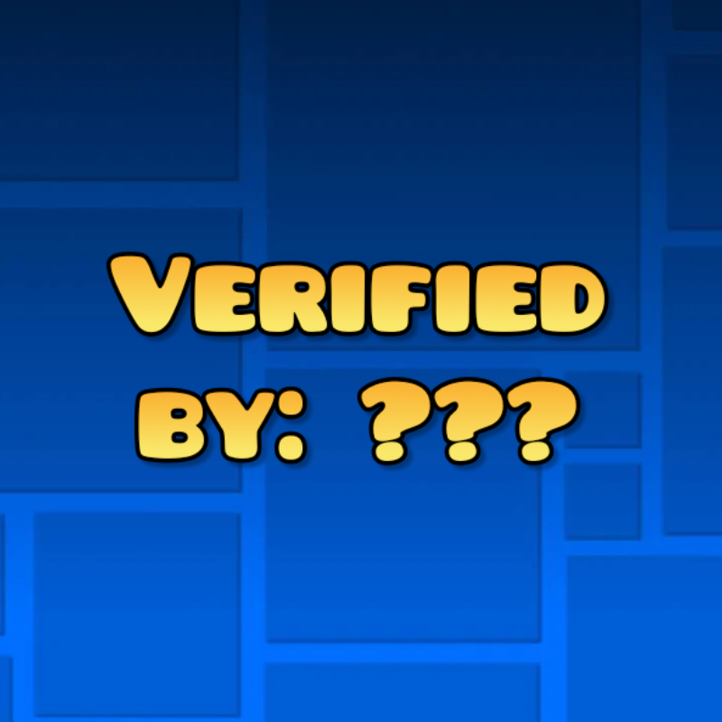

# Verifier Labels

  

**Displays AREDL verification data directly in the Level Info Layer.**

Verifier Labels fetches the original verifier and completion video for Extreme Demons using the [AREDL](https://aredl.net/) database.

### Features
* **Verifier Credits**: See the name of the player who verified the level.
* **Video Proof**: Clickable YouTube icon that opens the verification video in your browser.
* **Smart Caching**: Data is saved locally to ensure instant loading and reduced API calls.
* **Customizable**: Adjust the label position or toggle features via Geode settings.

### How to Use
1. Open any **Extreme Demon** level.
2. The verifier's name appears automatically below the level creator info.
3. Click the **YouTube icon** (if visible) to watch the proof.

### Configuration
Adjust these settings in the Geode menu:
* **Enable Labels**: Toggle the mod UI on or off.
* **Vertical Position**: Move the label up or down to avoid overlapping other mods.
* **Show YouTube Button**: Toggle the visibility of the video link icon.

### Requirements
* **Geometry Dash**: 2.2081+
* **Geode SDK**: 5.0.0-alpha.1+
* **Dependency**: `geode.node-ids`